<!-- README.md is generated from README.Rmd. Please edit that file -->

# bnmonitor

`bnmonitor` is a package for sensitivity analysis and robustness in
Bayesian networks (BNs).

## Installation

The package `bnmonitor` can be installed from GitHub using the command

``` r
# install.packages("devtools")
devtools::install_github("manueleleonelli/bnmonitor")
```

and loaded in R with

``` r
library(bnmonitor)
```

Note that `bnmonitor` requires the package `gRain` which, while on CRAN,
depends on packages that are on Bioconductor both directly and through
the `gRbase` package, which depends on `RBGL`:

``` r
BiocManager::install()
BiocManager::install(c("graph", "Rgraphviz", "RBGL"))
install.packages("gRain")
```

## Overview

`bnmonitor` provides a suite of function to investigate either a
data-learnt or an expert elicited BN. Its functions can be classified
into three main areas:

-   *Robustness in discrete BNs*: checking how well a BN represents a
    dataset;
-   *Sensitivity in discrete BNs*: assessing the effect of changes in
    the discrete BN’s probabilities;
-   *Sensitivity in continuous BNs*: assessing the effect of changes in
    the continuous BN’s probabilities, either in the standard or
    model-preserving framework

<!-- The prequential diagnostics examine the forecasts that flow from a model in sequence. -->
<!-- Each monitor given below indicates the probability of a particular observation based on the previous observations and the model structure.  -->
<!-- In the prequential mindset, we compute a probability of each subsequent observation based on all previous data points.  -->
<!-- These observations are then scored, and in this package we use the logarithmic score function. -->
<!-- The observations are then standardized to give a z-score statistic.  -->
<!-- Following the recommendation of Cowell (2007), scores indicate a poor fit where |z| > 1.96  -->
<!-- We demonstrate the efficacy of the prequential monitors with the Asia data set from the bnlearn package. Details of the variables (nodes) can be found in the documentation for bnlearn. -->

## Robustness

Consider the `asia` dataset available from `bnlearn`. Details of the
variables can be found in the `bnlearn` documentation.

``` r
library(bnlearn)
data(asia)
summary(asia)
#>    A          S          T          L          B          E          X       
#>  no :4958   no :2485   no :4956   no :4670   no :2451   no :4630   no :4431  
#>  yes:  42   yes:2515   yes:  44   yes: 330   yes:2549   yes: 370   yes: 569  
#>    D       
#>  no :2650  
#>  yes:2350
```

Consider two candidate BN models (Lauritzen and Spiegelhalter, 1988),
which only differ in the edge from `S` to `D`.

``` r
asia_bn <- bnlearn::model2network("[A][S][T|A][L|S][B|S][D|B:E][E|T:L][X|E]")
bnlearn::graphviz.plot(asia_bn) 
```

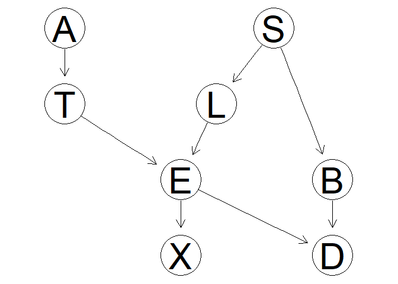

``` r
asia_bn_alt <-  bnlearn::model2network("[A][S][T|A][L|S][B|S][E|T:L][X|E][D|B:E:S]")
bnlearn::graphviz.plot(asia_bn_alt) 
```

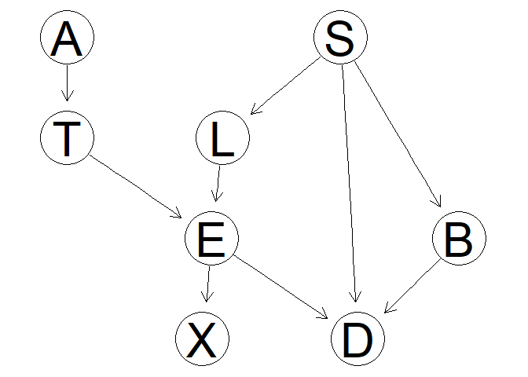

### Global monitor

<!-- The global monitor is equivalent to the Bayes Factor and offers a good assessment of the model as a whole.  -->
<!-- It is primarily useful for differentiating between candidate models as the global monitor pinpoints the nodes with different contributions for two candidate models. -->
<!-- We can assess the log likelihood contribution from each of the nodes and determine which nodes contribute the most to the global monitor. -->
<!-- global.monitor.graph provides a quick visual for the entire network.  -->
<!-- The darker the color, the more substantial the contribution of that node to the log likelihood. -->
<!-- The global monitor assesses the probability of observing the data given the model and as such does not particularly fit the prequential view.  -->
<!-- However, it is a quick and useful first diagnostic assessment. -->

A first useful diagnostic is the `global_monitor`, reporting the
contribution of each vertex to the log-likelihood of the model.

``` r
glob_asia <- global_monitor(dag = asia_bn, df = asia, alpha = 3)
glob_asia_alt <- global_monitor(dag = asia_bn_alt, df = asia, alpha = 3)
glob_asia
#>   Vertex      Score
#> 1      A  249.74568
#> 2      B 3020.72273
#> 3      D 2144.16059
#> 4      E   26.31263
#> 5      L 1101.55381
#> 6      S 3469.43743
#> 7      T  260.38452
#> 8      X  851.22579
glob_asia_alt
#>   Vertex      Score
#> 1      A  249.74568
#> 2      B 3020.72273
#> 3      D 2153.19484
#> 4      E   26.31263
#> 5      L 1101.55381
#> 6      S 3469.43743
#> 7      T  260.38452
#> 8      X  851.22579
```

In the alternative model, Dysnopea contributes more to the
log-likelihood.

Global monitors can be plotted giving a quick view of the decomposition
of the log-likelihood. The darker the color, the more substantial the
contribution of a vertex.

``` r
plot(glob_asia)
```

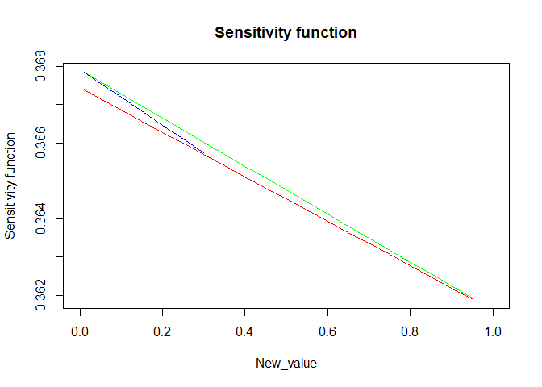

### Node monitor

There are two variants of node monitors.

-   The marginal node monitor computes the probability of the *i*th
    observation in the data set in turn after passing the evidence of
    the *i* − 1th cases in the data set.

-   The conditional node monitor computes the probability of the *i*th
    observation in the data set after passing evidence of the *i* − 1th
    cases in the data set, and the evidence for all nodes in the *i*th
    case except the node of interest.

As a quick survey of the nodes, the `node_monitor` command computes the
marginal and conditional monitors for the final observation in the data
set.

``` r
node_asia <- node_monitor(dag = asia_bn, df = asia)
node_asia
#>   node marg.z.score cond.z.score
#> 1    A   -0.1029759   -0.1029862
#> 2    S -114.8350581 -118.7946397
#> 3    T   -0.1054182   -0.1054288
#> 4    L   -0.3013303   -0.3013649
#> 5    B  -34.6833789  -35.0407002
#> 6    E   -0.3226028   -0.3226405
#> 7    X   -0.4234203   -0.4234785
#> 8    D  -10.4048397  -10.3678671
```

The scores indicate a poor fit of the probability distributions
specified for the Smoking, Bronchitis, and Dysnopea nodes, since these
are larger than 1.96 in absolute value. Plots can also be created to
give a visual counterpart of the node monitors.

``` r
plot(node_asia, which = "marginal")
```

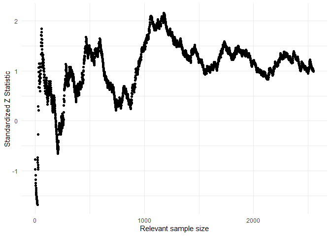

<!-- The modeller may decide which of these distributions is of the most interest.  -->
<!-- For the purposes of this vignette, we assume that we would like to check the forecasts for Dysnopea.  -->

As an illustration we investigate further the fit of the variable
Dysnopea.

The sequential marginal monitor `seq_marg_monitor` gives us a closer
look at which particular forecasts in the data set might cause this poor
fit. We examine the sequential monitor for both candidate models.

``` r
seq_asia <- seq_marg_monitor(dag = asia_bn, df = asia, node.name = "D")
seq_asia_alt <- seq_marg_monitor(dag = asia_bn_alt, df = asia, node.name = "D")
seq_asia
#> Marginal Node Monitor for D 
#>  Minimum      -2.182895 
#>  Maximum      0.446613
seq_asia_alt
#> Marginal Node Monitor for D 
#>  Minimum      -2.408245 
#>  Maximum      0.1543135
```

``` r
library(gridExtra)
grid.arrange(plot(seq_asia),plot(seq_asia_alt),ncol=2)
```

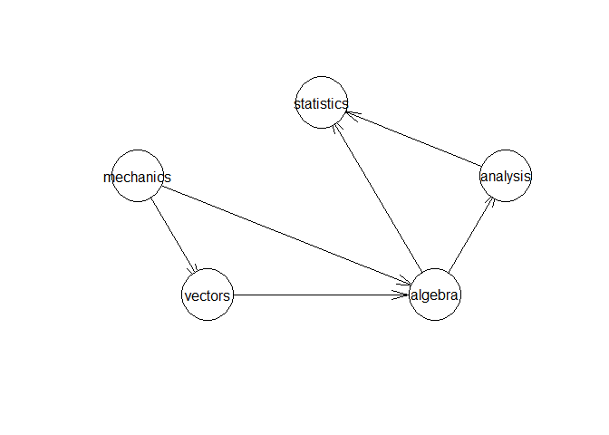

Both monitors indicate that for some observations there is a poor fit
(score above 1.96 in absolute value). In particular for the alternative
models the marginal monitor has larger values in absolute value.

A similar analysis can be conducted with `seq_marg_monitor`, which would
show that the model fits well (not reported here).

### Parent Child monitor

Once a vertex has been identified as a poor fit, further investigation
can be carried out to check for which values of the parents the model
provides a bad representation. This can be achieved with the
`seq_pa_ch_monitor` function.

As an illustration consider the `asia_bn` BN, the vertex `D` (Dysnopea),
the parent variable `B` (Bronchitis) which can take values `yes` and
`no`.

``` r
asia_pa_ch1 <- seq_pa_ch_monitor(dag = asia_bn, df = asia, node.name = "D", pa.names =  "B", pa.val =  "yes", alpha = 3)
asia_pa_ch1
#> Parent Child Node Monitor 
#>  Minimum      -1.674971 
#>  Maximum      2.158953
asia_pa_ch2 <- seq_pa_ch_monitor(dag = asia_bn, df = asia, node.name = "D", pa.names = "B", pa.val = "no", alpha = 3)
asia_pa_ch2
#> Parent Child Node Monitor 
#>  Minimum      -1.911069 
#>  Maximum      1.629946
grid.arrange(plot(asia_pa_ch1),plot(asia_pa_ch2), ncol = 2)
```

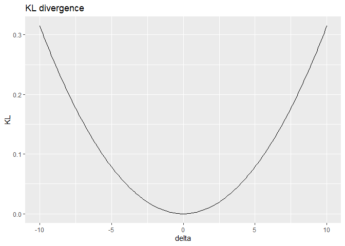

For this model, Dysnopea is adequately modeled for both values of
Bronchitis, since most scores largely fall in the recommended range.

### Influential observations

The last robustness tool is the absolute value of the log-likelihood
ratio between a model learnt without one observation and the one learnt
with the full dataset. Larger values are associated to atomic events
which influence the structural learning.

``` r
influence <- influential_obs(dag = asia_bn, df = asia, alpha = 3)
head(influence)
#>    A   S   T  L   B   E   X   D    score
#> 1 no yes  no no yes  no  no yes 1.448996
#> 2 no yes  no no  no  no  no  no 2.246368
#> 3 no  no yes no  no yes yes yes 6.218600
#> 4 no  no  no no yes  no  no yes 2.223474
#> 5 no  no  no no  no  no  no yes 3.435658
#> 6 no yes  no no  no  no  no yes 4.443592
plot(influence)
```

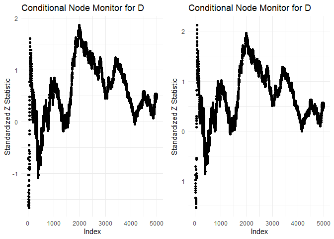

## Sensitivity in Discrete Bayesian Networks

The functionalities of `bnmonitor` for sensitivity analysis in Discrete
Bayesian Networks are illustrated using the `fire_alarm` network bundled
within the package representing a simple alarm system for fire
accidents.

``` r
graphviz.plot(fire_alarm)
```

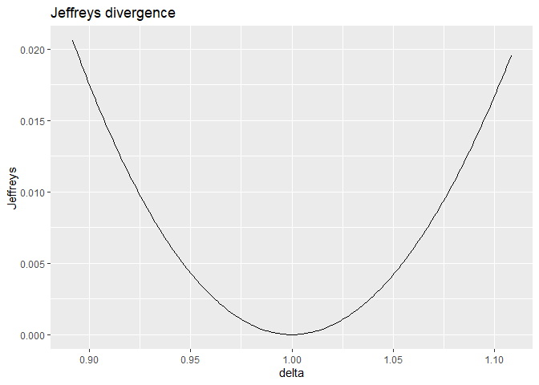

The network consists of 6 nodes (`Fire`, `Smoke`, `Tampering`, `Alarm`,
`Leaving` and `Report`) of either two or three levels.

### Covariation schemes

The aim of a sensitivity analysis is to assess how parameter changes
affect output probabilities of interest. When one parameter changes than
others need to be adjusted and this can be done in many ways, including
`proportional`, `uniform` and `order-preserving` schemes. Suppose we
vary the probability that `Alarm = FALSE` given that `Fire = TRUE` and
`Tampering = FALSE` from 0.01 to 0.1. The resulting probabilities from
the proportional covariation scheme can be computed as follows.

``` r
proportional_covar(bnfit = fire_alarm, node = "Alarm", value_node = "FALSE", value_parents = c("TRUE","FALSE"), new_value = 0.1)$Alarm$prob
#> , , Tampering = TRUE
#> 
#>              Fire
#> Alarm               TRUE      FALSE
#>   TRUE        0.60000000 0.65000000
#>   MALFUNCTION 0.20000000 0.20000000
#>   FALSE       0.20000000 0.15000000
#> 
#> , , Tampering = FALSE
#> 
#>              Fire
#> Alarm               TRUE      FALSE
#>   TRUE        0.83636364 0.00010000
#>   MALFUNCTION 0.06363636 0.65000000
#>   FALSE       0.10000000 0.34990000
```

The functions `uniform_covar` and `orderp_covar` have the same inputs
and return the BN where probabilities are updated using uniform and
order-preserving covariation, respectively.

### Sensitivity functions

Suppose we are interested in the probability that `Report = TRUE` and
how this varies with respect to the probability that `Alarm = FALSE`
conditional on `Fire = TRUE` and `Tampering = FALSE`. This can be
coputed with the function `sensitivity`.

``` r
sens <- sensitivity(bnfit = fire_alarm, interest_node = "Report", interest_node_value =  "TRUE" , node = "Alarm" , value_node = "FALSE", value_parents = c("TRUE","FALSE"), new_value = "all", covariation = "all")
plot(sens)
```


For all covariation schemes as the conditional probability of
`Alarm = FALSE` increases, the probability of `Report = TRUE` decreases.
The uniform covariation scheme is reported in red, the proportional in
green and the order-preserving in blue.

The function sensitivity also allows for conditional probabilities of
interest, not only marginals, which can be set by the options
`evidence_nodes` and `evidence_states`.

For such changes in the probability distribution of a BN, we can compute
the distance between the original and the varied networks using the
Chan-Darwiche distance (`CD`) and the Kullback-Leibler divergence
(`KL`). As an example cosnider `Alarm = MALFUNCTIOn` conditional on
`Fire = TRUE` and `Tampering = FALSE`.

``` r
cd_distance <- CD(fire_alarm, node = "Alarm", value_node = "MALFUNCTION", value_parents = c("TRUE","FALSE"), new_value = "all", covariation = "all")
kl_divergence <- KL(fire_alarm, node = "Alarm", value_node = "MALFUNCTION", value_parents = c("TRUE","FALSE"), new_value = "all", covariation = "all")
grid.arrange(plot(cd_distance), plot(kl_divergence),ncol=2)
```

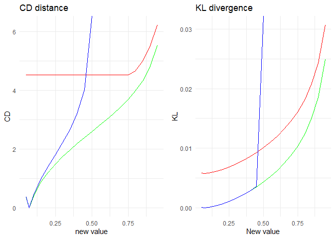

As expected proportional covariation has the smallest
distance/divergence of all covariation schemes.

### Sensitivity queries

Another task in sensitivity analysis is to identify parameter changes
that meet a specific constraint. As an example suppose we want the
probability `Report = TRUE` to be equal to 0.4. Which parameters could
we change to obtain such a probability? The answer can be obtained using
the function `sensquery`.

``` r
sensquery(bnfit = fire_alarm, interest_node = "Report", interest_node_value = "TRUE", new_value = 0.4)
#>        Node Value node Value parents Original value Suggested change
#> 1   Leaving       TRUE   MALFUNCTION         0.7300        0.7983961
#> 2    Report       TRUE          TRUE         0.7500        0.8164951
#> 3 Tampering       TRUE                       0.0200        0.2018769
#> 4      Fire       TRUE                       0.0100        0.1252059
#> 5     Alarm       TRUE   FALSE,FALSE         0.0001        0.1106591
#>   CD distance
#> 1   0.3816771
#> 2   0.3941673
#> 3   2.5172158
#> 4   2.6510913
#> 5   7.1262142
```

There are five parameter changes that would lead to a probability of
`Report = TRUE` of 0.4. These are ordered by the value of the CD
distance between the original and the new network, from smallest to
largest.

## Gaussian Bayesian networks

The functionalities of `bnmonitor` for sensitivity analysis in Gaussian
BNs are illustrated next using the `mathmarks` dataset bundled within
the package.

``` r
data(mathmarks)
head(mathmarks)
#>   mechanics vectors algebra analysis statistics
#> 1        77      82      67       67         81
#> 2        63      78      80       70         81
#> 3        75      73      71       66         81
#> 4        55      72      63       70         68
#> 5        63      63      65       70         63
#> 6        53      61      72       64         73
```

The data includes the grades (out of 100) of students in five maths
exams: mechanics, vectors, algebra, analysis and statistics.

The structure of a BN for this data is first learnt using the package
`bnlearn` and the maximum likelihood estimate of its parameters is
computed and stored in `bnfit`.

``` r
bn <- hc(mathmarks)
plot(bn)
```


``` r
bnfit <-bn.fit(bn, mathmarks)
```

To start the sensitivity analysis for the parameters of the learnt BN,
one first need to transform `bnfit` to objects of class `GBN` (for
standard sensitivity analysis) and `CI` (for model-preserving
sensitivity). This can be done using the functions `bn2gbn` and `bn2ci`
respectively.

``` r
gbn <- bn2gbn(bnfit)
ci <-  bn2ci(bnfit)
c(class(gbn), class(ci))
#> [1] "GBN" "CI"
```

### Perturbation of the mean vector

A varied Gaussian BN after a perturbation of an entry of the mean vector
can be obtained with the function `mean_var`, which can only be applied
to an object of class `GBN`. Below, we vary the fifth entry of the mean
vector (statistics) by an additive factor 10.

``` r
mean_varied <- cbind(gbn$order, round(gbn$mean, 2),round(mean_var(gbn = gbn, entry = 5, delta = 10)$mean, 2))
colnames(mean_varied) <- c("Course", "Original Mean", "Varied Mean")
mean_varied
#>      Course       Original Mean Varied Mean
#> [1,] "mechanics"  "38.95"       "38.95"    
#> [2,] "vectors"    "50.59"       "50.59"    
#> [3,] "algebra"    "50.6"        "50.6"     
#> [4,] "analysis"   "46.68"       "46.68"    
#> [5,] "statistics" "42.31"       "52.31"
```

The overall effect of such variations can be assessed in terms of
dissimilarity measures: the Kullback-Leibler divergence (`KL`) and
Jeffrey’s divergence (`Jeffreys`). For instance, let’s see what’s the
effect of variations in the mean of the statistics exam.

``` r
kl_var5 <- KL(gbn, where = "mean", entry = 5, delta = seq(-10,10,0.1))
jef_var5 <- Jeffreys(gbn, where = "mean", entry = 5, delta = seq(-10,10,0.1))
grid.arrange(plot(kl_var5), plot(jef_var5), ncol = 2)
```

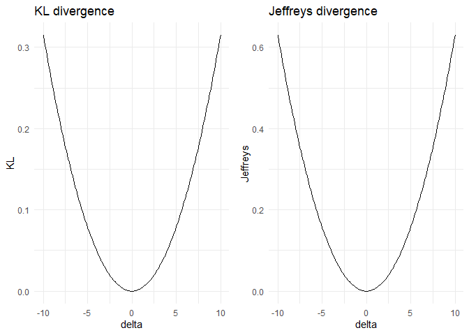

More interestingly, one can check the different effect of variations of
different paramenters (code not shown).

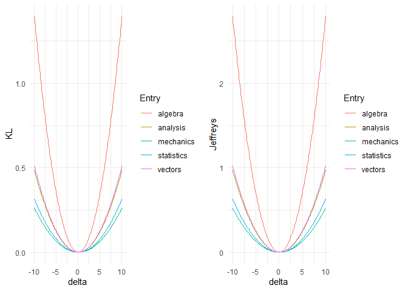

Misspecifications of the mean of the algebra exam would have the biggest
effect on the distribution of the Gaussian BN, since it leads to the
biggest distance between the original and the varied network.

### Perturbation of the covariance matrix

Care must be taken when performing perturbations of the covariance
matrix, for two reasons:

-   the perturbed matrix may not be positive semidefinite;

-   the perturbed matrix may not respect the conditional indepedences of
    the underlying BN.

Suppose we are interested in assessing the effect of varying the
covariance between `Statistics` and `Vectors`.

``` r
gbn$order
#> [1] "mechanics"  "vectors"    "algebra"    "analysis"   "statistics"
gbn$covariance
#>          [,1]      [,2]      [,3]      [,4]      [,5]
#> [1,] 305.7680 127.22257 101.57941 100.88420 109.66411
#> [2,] 127.2226 174.23649  85.65601  85.06978  92.47337
#> [3,] 101.5794  85.65601 114.56549 113.78140 123.68375
#> [4,] 100.8842  85.06978 113.78140 223.30480 157.73746
#> [5,] 109.6641  92.47337 123.68375 157.73746 303.49318
```

The parameter of interest correspond to the entry (2,5) of the
covariance matrix.

A standard perturbated covariance matrix can be constructed with the
`covariance_var` function. Suppose we want to increase the covariance
between `Statistics` and `Vectors` by an additive factor of 10.

``` r
d <- 10
covariance_var(gbn, entry = c(2,5), delta = d)$covariance
#>          [,1]      [,2]      [,3]      [,4]     [,5]
#> [1,] 305.7680 127.22257 101.57941 100.88420 109.6641
#> [2,] 127.2226 174.23649  85.65601  85.06978 102.4734
#> [3,] 101.5794  85.65601 114.56549 113.78140 123.6837
#> [4,] 100.8842  85.06978 113.78140 223.30480 157.7375
#> [5,] 109.6641 102.47337 123.68375 157.73746 303.4932
```

The above perturbation made the original network structure not valid for
the new covariation matrix. In order to ensure that the perturbed
covariance is still valid for the underlying network structure, we can
use model-preserving methods. These apply multiplicatively and not
additively as standard methods, but we apply the same change in the
covariance via the perturbation `delta` defined below. We can construct
various covariation matrices using the following commands:

``` r
delta <- (d + gbn$covariance[2,5])/gbn$covariance[2,5]
total_covar_matrix(ci, entry = c(2,5), delta = delta)
#>          [,1]     [,2]     [,3]     [,4]     [,5]
#> [1,] 1.108139 1.108139 1.108139 1.108139 1.108139
#> [2,] 1.108139 1.108139 1.108139 1.108139 1.000000
#> [3,] 1.108139 1.108139 1.108139 1.108139 1.108139
#> [4,] 1.108139 1.108139 1.108139 1.108139 1.108139
#> [5,] 1.108139 1.000000 1.108139 1.108139 1.108139
partial_covar_matrix(ci, entry = c(2,5), delta = delta)
#>          [,1]     [,2]     [,3]     [,4]     [,5]
#> [1,] 1.000000 1.000000 1.108139 1.108139 1.108139
#> [2,] 1.000000 1.000000 1.108139 1.108139 1.000000
#> [3,] 1.108139 1.108139 1.108139 1.108139 1.108139
#> [4,] 1.108139 1.108139 1.108139 1.108139 1.108139
#> [5,] 1.108139 1.000000 1.108139 1.108139 1.000000
row_covar_matrix(ci, entry = c(2,5), delta = delta)
#>          [,1] [,2]     [,3]     [,4]     [,5]
#> [1,] 1.000000    1 1.000000 1.000000 1.108139
#> [2,] 1.000000    1 1.000000 1.000000 1.000000
#> [3,] 1.000000    1 1.000000 1.000000 1.108139
#> [4,] 1.000000    1 1.000000 1.000000 1.108139
#> [5,] 1.108139    1 1.108139 1.108139 1.000000
col_covar_matrix(ci, entry = c(2,5), delta = delta)
#>      [,1]     [,2]     [,3]     [,4] [,5]
#> [1,]    1 1.000000 1.000000 1.000000    1
#> [2,]    1 1.000000 1.108139 1.108139    1
#> [3,]    1 1.108139 1.000000 1.000000    1
#> [4,]    1 1.108139 1.000000 1.000000    1
#> [5,]    1 1.000000 1.000000 1.000000    1
```

Importantly, notice that standard methods are applied to objects of
class `gbn`, whilst model-preserving methods operate over `ci` objects.

For any of the four available methods (`total`, `partial`, `row` and
`column`) the perturbed covariance matrix can be calculated with the
function `model_pres_cov`. For instance in the case of a partial
covariation:

``` r
model_pres_cov(ci, type = "partial", entry = c(2,5), delta = delta)$covariance
#>          [,1]      [,2]      [,3]      [,4]     [,5]
#> [1,] 305.7680 127.22257 112.56414 111.79374 121.5231
#> [2,] 127.2226 174.23649  94.91879  94.26916 102.4734
#> [3,] 112.5641  94.91879 126.95451 126.08563 137.0588
#> [4,] 111.7937  94.26916 126.08563 247.45281 174.7951
#> [5,] 121.5231 102.47337 137.05881 174.79507 303.4932
```

Having constructed various covariation matrices, we can assess how far
apart the original and the perturbed distributions are for various
covariation methods. Available dissimilarity measures are Frobenius norm
(`Fro`), Kullback-Leibler divergence (`KL`) and Jeffrey’s divergence
(`Jeffreys`). Let’s consider the Froenius norm.

``` r
d <- seq(-10, 10, 0.1)
delta <- (d + gbn$covariance[2,5])/gbn$covariance[2,5]
cov_stand <- Fro(gbn, entry = c(2,5), delta = d)
cov_col <- Fro(ci, type = "column", entry = c(2,5), delta = delta)
grid.arrange(plot(cov_stand), plot(cov_col), ncol = 2)
```

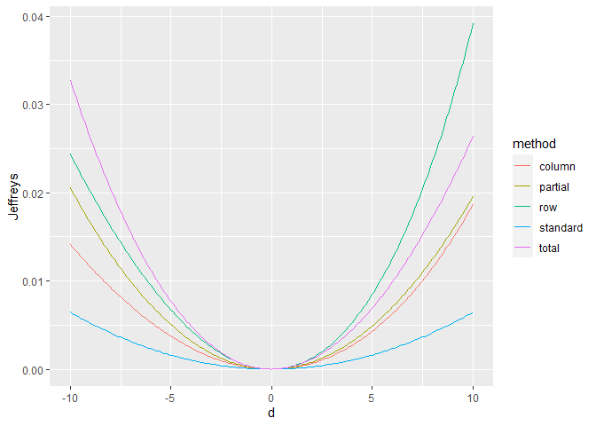

As for the mean, we can check which entry of the covariance matrix has
the biggest impact if varied. For simplicity here we pick the standard
method only (code not shown).


From the above plot we can notice that the less robust entries of the
covariance matrix are the variance of `algebra`, the covariance between
`algebra` and `analysis`, and the covariance between `algebra` and
`vectors`.

Another method to quickly have an overview of the effect of all
parameters is `KL_bounds` which creates a table with upper bounds to the
Kullback-Leibler divergence for all entries of the covariance matrix and
all covariation methods.

``` r
KL_bounds(ci, delta = 1.2)
#>    row col   standard    total  partial row_based col_based
#> 1    1   1 0.08745398 2.721918 2.410370  2.410370  2.410370
#> 2    1   2 0.11113375 2.721918 2.424361  2.424361  2.424361
#> 3    1   3 0.18319140 2.721918 2.661624  2.563009  2.563009
#> 4    1   4 0.03157487 2.721918 2.661624  2.563009  2.563009
#> 5    1   5 0.02356461 2.721918 2.661624  2.508260  2.508260
#> 6    2   2 0.10479440 2.721918 2.410370  2.410370  2.410370
#> 7    2   3 0.34492801 2.721918 2.661624  2.563009  2.563009
#> 8    2   4 0.04575001 2.721918 2.661624  2.563009  2.563009
#> 9    2   5 0.03394882 2.721918 2.661624  2.508260  2.508260
#> 10   3   3 0.26127953 2.721918 2.661624  2.563009  2.563009
#> 11   3   4 1.02446834 2.721918 2.661624  2.563009  2.563009
#> 12   3   5 0.54029638 2.721918 2.661624  2.508260  2.508260
#> 13   4   4 0.14403323 2.721918 2.661624  2.563009  2.563009
#> 14   4   5 0.19426900 2.721918 2.661624  2.508260  2.508260
#> 15   5   5 0.11777072 2.721918 2.410370  2.410370  2.410370
```

By looking at the standard method column, we have the confirmation that
the 11th entry, corresponding to `algebra/analysis`, is the most
critical for the robustness of the network.
