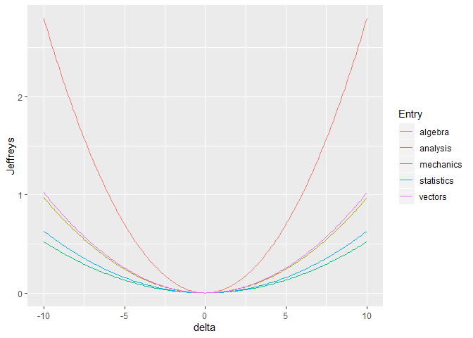

<!-- README.md is generated from README.Rmd. Please edit that file -->

# bnmonitor

`bnmonitor` is a package for sensitivity analysis and robustness in
Bayesian networks.

## Installation

The package `bnmonitor` can be installed from GitHub using the command

``` r
# install.packages("devtools")
devtools::install_github("manueleleonelli/bnmonitor")
```

and loaded in R with

``` r
library(bnmonitor)
```

Note that `bnmonitor` requires the package `gRain` which, while on CRAN,
depends on packages that are on Bioconductor both directly and through
the `gRbase` package, which depends on `RBGL`:

``` r
BiocManager::install()
BiocManager::install(c("graph", "Rgraphviz", "RBGL"))
install.packages("gRain")
```

## Overview

## Gaussian Bayesian Networks

The functionalities of `bnmonitor` for sensitivity analysis in Gaussian
Bayesian networks are illustrated next using the `mathmarks` dataset
bundled within the package.

``` r
data(mathmarks)
head(mathmarks)
#>   mechanics vectors algebra analysis statistics
#> 1        77      82      67       67         81
#> 2        63      78      80       70         81
#> 3        75      73      71       66         81
#> 4        55      72      63       70         68
#> 5        63      63      65       70         63
#> 6        53      61      72       64         73
```

The data includes the grades (out of 100) of students in five maths
exams: mechanics, vectors, algebra, analysis and statistics.

The structure of a Bayesian network for this data is first learnt using
the package `bnlearn` and the maximum likelihood estimate of its
parameters is computed and stored in `bnfit`.

``` r
library(bnlearn)
bn <- hc(mathmarks)
plot(bn)
```


``` r
bnfit <-bn.fit(bn,mathmarks)
```

To start the sensitivity analysis for the parameters of the learnt
Bayesian network, one first need to transform `bnfit` to objects of
class `GBN` (for standard sensitivity analysis) and `CI` (for
model-preserving sensitivity). This can be done using the functions
`bn2gbn` and `bn2ci` respectively.

``` r
gbn <- bn2gbn(bnfit)
ci <-  bn2ci(bnfit)
c(class(gbn),class(ci))
#> [1] "GBN" "CI"
```

#### Perturbation of the mean vector

A varied GBN after a perturbation of an entry of the mean vector can be
obtained with the function `mean_var`, which can only be applied to an
object of class `GBN`. Below, we vary the fifth entry of the mean vector
(statistics) by an additive factor 10.

``` r
rbind( t(gbn$mean),t(mean_var(gbn,entry = 5, delta = 10)$mean))
#>          [,1]     [,2]     [,3]     [,4]     [,5]
#> [1,] 38.95455 50.59091 50.60227 46.68182 42.30682
#> [2,] 38.95455 50.59091 50.60227 46.68182 52.30682
```

The overall effect of such variations can be assessed in terms of
dissimilarity measures: the Kullback-Leibler divergence (`KL`) and
Jeffrey’s divergence (`Jeffreys`). For instance, let’s see what’s the
effect of variations in the mean of the statistics exam.

``` r
mean_var5 <- KL(gbn, "mean", entry=5, delta = seq(-10,10,0.1))
mean_var5$plot
```


More interestingly, one can check the different effect of variations of
different paramenters.


Therefore, misspecifications of the mean of the algebra exam would have
the biggest effect on the distribution of the Gaussian Bayesian network.

#### Perturbation of the covariance matrix

Care must be taken when performing perturbations of the covariance
matrix, for two reasons: (1) the perturbed matrix may not be positive
semidefinite; (2) the perturbed matrix may not respect the conditional
indepedences of the underlying Bayesian network.

Suppose we are interested in assessing the effect of varying the
covariance between `Statistics` and `Vectors` corresponding to the entry
(2,5) of the covariance matrix below.

``` r
gbn$order
#> [1] "mechanics"  "vectors"    "algebra"    "analysis"   "statistics"
gbn$covariance
#>          [,1]      [,2]      [,3]      [,4]      [,5]
#> [1,] 305.7680 127.22257 101.57941 100.88420 109.66411
#> [2,] 127.2226 174.23649  85.65601  85.06978  92.47337
#> [3,] 101.5794  85.65601 114.56549 113.78140 123.68375
#> [4,] 100.8842  85.06978 113.78140 223.30480 157.73746
#> [5,] 109.6641  92.47337 123.68375 157.73746 303.49318
```

A standard perturbated covariance matrix can be constructed with the
`covariance_var` function. Suppose we want to increase the covariance
between `Statistics` and `Vectors` by a factor of 10.

``` r
d <- 10
covariance_var(gbn, c(2,5), d)$covariance
#>          [,1]      [,2]      [,3]      [,4]     [,5]
#> [1,] 305.7680 127.22257 101.57941 100.88420 109.6641
#> [2,] 127.2226 174.23649  85.65601  85.06978 102.4734
#> [3,] 101.5794  85.65601 114.56549 113.78140 123.6837
#> [4,] 100.8842  85.06978 113.78140 223.30480 157.7375
#> [5,] 109.6641 102.47337 123.68375 157.73746 303.4932
```

The above perturbation made the original network structure not valid for
the new covariation matrix. In order to ensure that the perturbed
covariance is still valid for the underlying network structure, we can
use model-preserving methods. These apply multiplicatively and not
additively as standard methods, but we apply the same change in the
covariance via the perturbation `delta` defined below. We can construct
various covarioation matrices using the following commands:

``` r
delta <- (d + gbn$covariance[2,5])/gbn$covariance[2,5]
total_covar_matrix(ci,c(2,5), delta)
#>          [,1]     [,2]     [,3]     [,4]     [,5]
#> [1,] 1.108139 1.108139 1.108139 1.108139 1.108139
#> [2,] 1.108139 1.108139 1.108139 1.108139 1.000000
#> [3,] 1.108139 1.108139 1.108139 1.108139 1.108139
#> [4,] 1.108139 1.108139 1.108139 1.108139 1.108139
#> [5,] 1.108139 1.000000 1.108139 1.108139 1.108139
partial_covar_matrix(ci,c(2,5),delta)
#>          [,1]     [,2]     [,3]     [,4]     [,5]
#> [1,] 1.000000 1.000000 1.108139 1.108139 1.108139
#> [2,] 1.000000 1.000000 1.108139 1.108139 1.000000
#> [3,] 1.108139 1.108139 1.108139 1.108139 1.108139
#> [4,] 1.108139 1.108139 1.108139 1.108139 1.108139
#> [5,] 1.108139 1.000000 1.108139 1.108139 1.000000
row_covar_matrix(ci,c(2,5),delta)
#>          [,1] [,2]     [,3]     [,4]     [,5]
#> [1,] 1.000000    1 1.000000 1.000000 1.108139
#> [2,] 1.000000    1 1.000000 1.000000 1.000000
#> [3,] 1.000000    1 1.000000 1.000000 1.108139
#> [4,] 1.000000    1 1.000000 1.000000 1.108139
#> [5,] 1.108139    1 1.108139 1.108139 1.000000
col_covar_matrix(ci,c(2,5),delta)
#>      [,1]     [,2]     [,3]     [,4] [,5]
#> [1,]    1 1.000000 1.000000 1.000000    1
#> [2,]    1 1.000000 1.108139 1.108139    1
#> [3,]    1 1.108139 1.000000 1.000000    1
#> [4,]    1 1.108139 1.000000 1.000000    1
#> [5,]    1 1.000000 1.000000 1.000000    1
```

For any of the four available methods (`total`, `partial`, `row` and
`column`) the perturbed covariance matrix can be calculated with the
function `model_pres_cov`. For instance in the case of a partial
covariation:

``` r
model_pres_cov(ci,"partial",c(2,5),delta)$covariance
#>          [,1]      [,2]      [,3]      [,4]     [,5]
#> [1,] 305.7680 127.22257 112.56414 111.79374 121.5231
#> [2,] 127.2226 174.23649  94.91879  94.26916 102.4734
#> [3,] 112.5641  94.91879 126.95451 126.08563 137.0588
#> [4,] 111.7937  94.26916 126.08563 247.45281 174.7951
#> [5,] 121.5231 102.47337 137.05881 174.79507 303.4932
```

Having constructed various covariation matrices, we can assess how far
apart the original and the perturbed distributions are for various
covariations methods. Available dissimilarity measures are Frobenius
norm (`Fro`), Kullback-Leibler divergence (`KL`) and Jeffrey’s
divergence (`Jeffreys`).

``` r
d <- seq(-10,10,0.1)
delta <- (d+gbn$covariance[2,5])/gbn$covariance[2,5]
#standard <- Jeffreys(gbn,"covariance", c(2,5), d)
#standard
```
