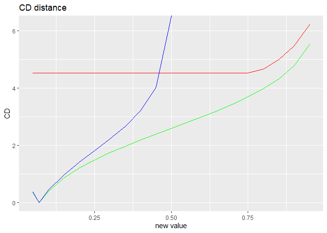
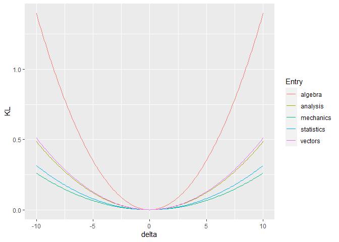
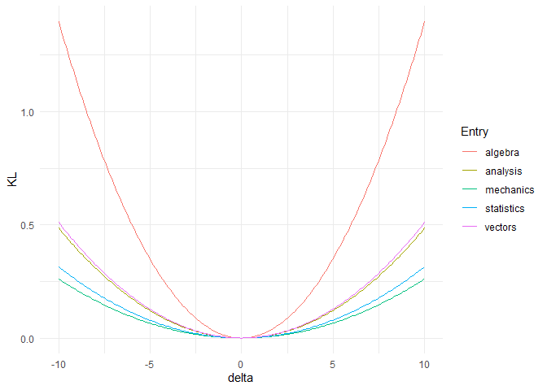

<!-- README.md is generated from README.Rmd. Please edit that file -->

# bnmonitor

`bnmonitor` is a package for sensitivity analysis and robustness in
Bayesian networks.

## Installation

The package `bnmonitor` can be installed from GitHub using the command

``` r
# install.packages("devtools")
devtools::install_github("manueleleonelli/bnmonitor")
```

and loaded in R with

``` r
library(bnmonitor)
```

Note that `bnmonitor` requires the package `gRain` which, while on CRAN,
depends on packages that are on Bioconductor both directly and through
the `gRbase` package, which depends on `RBGL`:

``` r
BiocManager::install()
BiocManager::install(c("graph", "Rgraphviz", "RBGL"))
install.packages("gRain")
```

## Overview

#### Discrete Bayesian Networks

The functionalities of `bnmonitor` for sensitivity analysis in Discrete
Bayesian Networks are illustrated using the `fire_alarm` network bundled
within the package representing a simple alarm system for fire
accidents.

``` r
library(bnlearn)
graphviz.plot(fire_alarm)
```


The network consists of 6 nodes (`Fire`, `Smoke`, `Tampering`, `Alarm`,
`Leaving` and `Report`) of either two or three levels. The conditional
probability tables can be investigated by typing `fire_alarm`.

``` r
fire_alarm
#> 
#>   Bayesian network parameters
#> 
#>   Parameters of node Fire (multinomial distribution)
#> 
#> Conditional probability table:
#>  
#>  TRUE FALSE 
#>  0.01  0.99 
#> 
#>   Parameters of node Smoke (multinomial distribution)
#> 
#> Conditional probability table:
#>  
#>        Fire
#> Smoke   TRUE FALSE
#>   TRUE  0.90  0.01
#>   FALSE 0.10  0.99
#> 
#>   Parameters of node Alarm (multinomial distribution)
#> 
#> Conditional probability table:
#>  
#> , , Tampering = TRUE
#> 
#>              Fire
#> Alarm           TRUE  FALSE
#>   TRUE        0.6000 0.6500
#>   MALFUNCTION 0.2000 0.2000
#>   FALSE       0.2000 0.1500
#> 
#> , , Tampering = FALSE
#> 
#>              Fire
#> Alarm           TRUE  FALSE
#>   TRUE        0.9200 0.0001
#>   MALFUNCTION 0.0700 0.6500
#>   FALSE       0.0100 0.3499
#> 
#> 
#>   Parameters of node Tampering (multinomial distribution)
#> 
#> Conditional probability table:
#>  
#>  TRUE FALSE 
#>  0.02  0.98 
#> 
#>   Parameters of node Leaving (multinomial distribution)
#> 
#> Conditional probability table:
#>  
#>        Alarm
#> Leaving  TRUE MALFUNCTION FALSE
#>   TRUE  0.880       0.730 0.001
#>   FALSE 0.120       0.270 0.999
#> 
#>   Parameters of node Report (multinomial distribution)
#> 
#> Conditional probability table:
#>  
#>        Leaving
#> Report  TRUE FALSE
#>   TRUE  0.75  0.01
#>   FALSE 0.25  0.99
```

The aim of a sensitivity analysis is to assess how parameter changes
affect output probabilities of interest. When one parameter changes than
others need to covary in order to respect the sum to one condition of
probabilities. In the binary case this is obvious, since the covaried
probability is equal to one minus the varied one. However, when there
are more than two probabilities there are multiple covariation schemes
that can be applied, including `proportional`, `uniform` and
`order-preserving`. Suppose we vary the probability that `Alarm = FALSE`
given that `Fire = TRUE` and `Tampering = FALSE` from 0.01 to 0.1. The
resulting probabilities from different covariation schemes can be
computed as
follows.

``` r
proportional_covar(fire_alarm,"Alarm", "FALSE", c("TRUE","FALSE"), 0.1)$Alarm$prob
#> , , Tampering = TRUE
#> 
#>              Fire
#> Alarm               TRUE      FALSE
#>   TRUE        0.60000000 0.65000000
#>   MALFUNCTION 0.20000000 0.20000000
#>   FALSE       0.20000000 0.15000000
#> 
#> , , Tampering = FALSE
#> 
#>              Fire
#> Alarm               TRUE      FALSE
#>   TRUE        0.83636364 0.00010000
#>   MALFUNCTION 0.06363636 0.65000000
#>   FALSE       0.10000000 0.34990000
uniform_covar(fire_alarm,"Alarm", "FALSE", c("TRUE","FALSE"), 0.1)$Alarm$prob
#> , , Tampering = TRUE
#> 
#>              Fire
#> Alarm           TRUE  FALSE
#>   TRUE        0.6000 0.6500
#>   MALFUNCTION 0.2000 0.2000
#>   FALSE       0.2000 0.1500
#> 
#> , , Tampering = FALSE
#> 
#>              Fire
#> Alarm           TRUE  FALSE
#>   TRUE        0.4500 0.0001
#>   MALFUNCTION 0.4500 0.6500
#>   FALSE       0.1000 0.3499
orderp_covar(fire_alarm,"Alarm", "FALSE", c("TRUE","FALSE"), 0.1)$Alarm$prob
#> , , Tampering = TRUE
#> 
#>              Fire
#> Alarm             TRUE    FALSE
#>   TRUE        0.600000 0.650000
#>   MALFUNCTION 0.200000 0.200000
#>   FALSE       0.200000 0.150000
#> 
#> , , Tampering = FALSE
#> 
#>              Fire
#> Alarm             TRUE    FALSE
#>   TRUE        0.756701 0.000100
#>   MALFUNCTION 0.143299 0.650000
#>   FALSE       0.100000 0.349900
```

Suppose we are interested in the probability that `Report = TRUE` and
how this varies with respect to the probability that `Alarm = FALSE`
conditional on `Fire = TRUE` and `Tampering = FALSE`. This functional
relationship is reported by the sensitivity function which can be
computed and plotted using the function
`sensitivity`.

``` r
sensitivity(fire_alarm, "Report", "TRUE" , node = "Alarm" , value_node = "FALSE", value_parents = c("TRUE","FALSE"), new_value = "all", covariation = "all")
#> 
#> Attaching package: 'gRbase'
#> The following objects are masked from 'package:bnlearn':
#> 
#>     ancestors, children, parents
```


    #> $sensitivity
    #>    New value   Uniform Proportional Order Preserving
    #> 1       0.01 0.3673824    0.3678447        0.3678447
    #> 2       0.05 0.3671492    0.3675928        0.3675543
    #> 3       0.10 0.3668576    0.3672779        0.3671913
    #> 4       0.15 0.3665661    0.3669630        0.3668282
    #> 5       0.20 0.3662746    0.3666482        0.3664652
    #> 6       0.25 0.3659830    0.3663333        0.3661022
    #> 7       0.30 0.3656915    0.3660184        0.3657392
    #> 8       0.35 0.3654000    0.3657035               NA
    #> 9       0.40 0.3651084    0.3653886               NA
    #> 10      0.45 0.3648169    0.3650738               NA
    #> 11      0.50 0.3645254    0.3647589               NA
    #> 12      0.55 0.3642339    0.3644440               NA
    #> 13      0.60 0.3639423    0.3641291               NA
    #> 14      0.65 0.3636508    0.3638142               NA
    #> 15      0.70 0.3633593    0.3634994               NA
    #> 16      0.75 0.3630677    0.3631845               NA
    #> 17      0.80 0.3627762    0.3628696               NA
    #> 18      0.85 0.3624847    0.3625547               NA
    #> 19      0.90 0.3621931    0.3622398               NA
    #> 20      0.95 0.3619016    0.3619250               NA
    #> 
    #> $plot
    #> NULL

For all covariation schemes as the conditional probability of `Alarm =
FALSE` increases, the probability of `Report = TRUE` decreases. The
uniform covariation scheme is reported in red, the proportional in green
and the order-preserving in blue.

The function sensitivity also allows for conditional probabilities of
interest, not only marginals, which can be set by the options
`evidence_nodes` and `evidence_states`.

For such changes in the probability distribution of a Bayesian networks,
we can compute the distance between the original and the varied networks
using the Chan-Darwiche distance (`CD`) and the Kullback-Leibler
divergence (`KL`). As an example we use `CD` for `Alarm = MALFUNCTIOn`
conditional on `Fire = TRUE` and `Tampering =
FALSE`.

``` r
CD(fire_alarm, node = "Alarm" , value_node = "MALFUNCTION", value_parents = c("TRUE","FALSE"), new_value = "all", covariation = "all")
#> $CD
#>    New value  Uniform Proportional Order Preserving
#> 1       0.05 4.521789    0.3577496        0.3610133
#> 2       0.07 4.521789    0.0000000        0.0000000
#> 3       0.10 4.521789    0.3894648        0.4289956
#> 4       0.15 4.521789    0.8520883        0.9679921
#> 5       0.20 4.521789    1.2003950        1.4098249
#> 6       0.25 4.521789    1.4880771        1.8152900
#> 7       0.30 4.521789    1.7393915        2.2207551
#> 8       0.35 4.521789    1.9676501        2.6625878
#> 9       0.40 4.521789    2.1812242        3.2015843
#> 10      0.45 4.521789    2.3860186        4.0125145
#> 11      0.50 4.521789    2.5866893              Inf
#> 12      0.55 4.521789    2.7873600               NA
#> 13      0.60 4.521789    2.9921545               NA
#> 14      0.65 4.521789    3.2057286               NA
#> 15      0.70 4.521789    3.4339872               NA
#> 16      0.75 4.521789    3.6853016               NA
#> 17      0.80 4.655320    3.9729837               NA
#> 18      0.85 5.003627    4.3212904               NA
#> 19      0.90 5.466250    4.7839139               NA
#> 20      0.95 6.213465    5.5311283               NA
#> 
#> $plot
```



As expected proportional covariation has the smallest CD distance of all
covariation schemes.

Another task in sensitivity analysis is to identify parameter changes
that meet a specific constraint. As an example suppose we want the
probability `Report = TRUE` to be equal to 0.4. Which parameters could
we change to obtain such a probability? The answer can be obtained using
the function `sensquery`.

``` r
sensquery(fire_alarm,"Report","TRUE", 0.4)
#>        Node Value node Value parents Original value Suggested change
#> 1   Leaving       TRUE   MALFUNCTION         0.7300        0.7983961
#> 2    Report       TRUE          TRUE         0.7500        0.8164951
#> 3 Tampering       TRUE                       0.0200        0.2018769
#> 4      Fire       TRUE                       0.0100        0.1252059
#> 5     Alarm       TRUE   FALSE,FALSE         0.0001        0.1106591
#>   CD distance
#> 1   0.3816771
#> 2   0.3941673
#> 3   2.5172158
#> 4   2.6510913
#> 5   7.1262142
```

In `sensquery` covarying parameters are always changed according to a
proportional scheme. The output reports the parameters that could be
changed, which value they need to be changed to, and the CD distance
between the original and the varied network.

## Gaussian Bayesian Networks

The functionalities of `bnmonitor` for sensitivity analysis in Gaussian
Bayesian networks are illustrated next using the `mathmarks` dataset
bundled within the package.

``` r
data(mathmarks)
head(mathmarks)
#>   mechanics vectors algebra analysis statistics
#> 1        77      82      67       67         81
#> 2        63      78      80       70         81
#> 3        75      73      71       66         81
#> 4        55      72      63       70         68
#> 5        63      63      65       70         63
#> 6        53      61      72       64         73
```

The data includes the grades (out of 100) of students in five maths
exams: mechanics, vectors, algebra, analysis and statistics.

The structure of a Bayesian network for this data is first learnt using
the package `bnlearn` and the maximum likelihood estimate of its
parameters is computed and stored in `bnfit`.

``` r
library(bnlearn)
bn <- hc(mathmarks)
plot(bn)
```


``` r
bnfit <-bn.fit(bn,mathmarks)
```

To start the sensitivity analysis for the parameters of the learnt
Bayesian network, one first need to transform `bnfit` to objects of
class `GBN` (for standard sensitivity analysis) and `CI` (for
model-preserving sensitivity). This can be done using the functions
`bn2gbn` and `bn2ci` respectively.

``` r
gbn <- bn2gbn(bnfit)
ci <-  bn2ci(bnfit)
c(class(gbn),class(ci))
#> [1] "GBN" "CI"
```

#### Perturbation of the mean vector

A varied GBN after a perturbation of an entry of the mean vector can be
obtained with the function `mean_var`, which can only be applied to an
object of class `GBN`. Below, we vary the fifth entry of the mean vector
(statistics) by an additive factor
10.

``` r
rbind(gbn$order,round(t(gbn$mean),2),round(t(mean_var(gbn,entry = 5, delta = 10)$mean),2))
#>      [,1]        [,2]      [,3]      [,4]       [,5]        
#> [1,] "mechanics" "vectors" "algebra" "analysis" "statistics"
#> [2,] "38.95"     "50.59"   "50.6"    "46.68"    "42.31"     
#> [3,] "38.95"     "50.59"   "50.6"    "46.68"    "52.31"
```

The overall effect of such variations can be assessed in terms of
dissimilarity measures: the Kullback-Leibler divergence (`KL`) and
Jeffrey’s divergence (`Jeffreys`). For instance, let’s see what’s the
effect of variations in the mean of the statistics exam.

``` r
mean_var5 <- KL(gbn, "mean", entry=5, delta = seq(-10,10,0.1))
mean_var5$plot
```


More interestingly, one can check the different effect of variations of
different paramenters.


Therefore, misspecifications of the mean of the algebra exam would have
the biggest effect on the distribution of the Gaussian Bayesian network.

#### Perturbation of the covariance matrix

Care must be taken when performing perturbations of the covariance
matrix, for two reasons: (1) the perturbed matrix may not be positive
semidefinite; (2) the perturbed matrix may not respect the conditional
indepedences of the underlying Bayesian network.

Suppose we are interested in assessing the effect of varying the
covariance between `Statistics` and `Vectors` corresponding to the entry
(2,5) of the covariance matrix below.

``` r
gbn$order
#> [1] "mechanics"  "vectors"    "algebra"    "analysis"   "statistics"
gbn$covariance
#>          [,1]      [,2]      [,3]      [,4]      [,5]
#> [1,] 305.7680 127.22257 101.57941 100.88420 109.66411
#> [2,] 127.2226 174.23649  85.65601  85.06978  92.47337
#> [3,] 101.5794  85.65601 114.56549 113.78140 123.68375
#> [4,] 100.8842  85.06978 113.78140 223.30480 157.73746
#> [5,] 109.6641  92.47337 123.68375 157.73746 303.49318
```

A standard perturbated covariance matrix can be constructed with the
`covariance_var` function. Suppose we want to increase the covariance
between `Statistics` and `Vectors` by a factor of 10.

``` r
d <- 10
covariance_var(gbn, c(2,5), d)$covariance
#>          [,1]      [,2]      [,3]      [,4]     [,5]
#> [1,] 305.7680 127.22257 101.57941 100.88420 109.6641
#> [2,] 127.2226 174.23649  85.65601  85.06978 102.4734
#> [3,] 101.5794  85.65601 114.56549 113.78140 123.6837
#> [4,] 100.8842  85.06978 113.78140 223.30480 157.7375
#> [5,] 109.6641 102.47337 123.68375 157.73746 303.4932
```

The above perturbation made the original network structure not valid for
the new covariation matrix. In order to ensure that the perturbed
covariance is still valid for the underlying network structure, we can
use model-preserving methods. These apply multiplicatively and not
additively as standard methods, but we apply the same change in the
covariance via the perturbation `delta` defined below. We can construct
various covarioation matrices using the following commands:

``` r
delta <- (d + gbn$covariance[2,5])/gbn$covariance[2,5]
total_covar_matrix(ci,c(2,5), delta)
#>          [,1]     [,2]     [,3]     [,4]     [,5]
#> [1,] 1.108139 1.108139 1.108139 1.108139 1.108139
#> [2,] 1.108139 1.108139 1.108139 1.108139 1.000000
#> [3,] 1.108139 1.108139 1.108139 1.108139 1.108139
#> [4,] 1.108139 1.108139 1.108139 1.108139 1.108139
#> [5,] 1.108139 1.000000 1.108139 1.108139 1.108139
partial_covar_matrix(ci,c(2,5),delta)
#>          [,1]     [,2]     [,3]     [,4]     [,5]
#> [1,] 1.000000 1.000000 1.108139 1.108139 1.108139
#> [2,] 1.000000 1.000000 1.108139 1.108139 1.000000
#> [3,] 1.108139 1.108139 1.108139 1.108139 1.108139
#> [4,] 1.108139 1.108139 1.108139 1.108139 1.108139
#> [5,] 1.108139 1.000000 1.108139 1.108139 1.000000
row_covar_matrix(ci,c(2,5),delta)
#>          [,1] [,2]     [,3]     [,4]     [,5]
#> [1,] 1.000000    1 1.000000 1.000000 1.108139
#> [2,] 1.000000    1 1.000000 1.000000 1.000000
#> [3,] 1.000000    1 1.000000 1.000000 1.108139
#> [4,] 1.000000    1 1.000000 1.000000 1.108139
#> [5,] 1.108139    1 1.108139 1.108139 1.000000
col_covar_matrix(ci,c(2,5),delta)
#>      [,1]     [,2]     [,3]     [,4] [,5]
#> [1,]    1 1.000000 1.000000 1.000000    1
#> [2,]    1 1.000000 1.108139 1.108139    1
#> [3,]    1 1.108139 1.000000 1.000000    1
#> [4,]    1 1.108139 1.000000 1.000000    1
#> [5,]    1 1.000000 1.000000 1.000000    1
```

For any of the four available methods (`total`, `partial`, `row` and
`column`) the perturbed covariance matrix can be calculated with the
function `model_pres_cov`. For instance in the case of a partial
covariation:

``` r
model_pres_cov(ci,"partial",c(2,5),delta)$covariance
#>          [,1]      [,2]      [,3]      [,4]     [,5]
#> [1,] 305.7680 127.22257 112.56414 111.79374 121.5231
#> [2,] 127.2226 174.23649  94.91879  94.26916 102.4734
#> [3,] 112.5641  94.91879 126.95451 126.08563 137.0588
#> [4,] 111.7937  94.26916 126.08563 247.45281 174.7951
#> [5,] 121.5231 102.47337 137.05881 174.79507 303.4932
```

Having constructed various covariation matrices, we can assess how far
apart the original and the perturbed distributions are for various
covariations methods. Available dissimilarity measures are Frobenius
norm (`Fro`), Kullback-Leibler divergence (`KL`) and Jeffrey’s
divergence (`Jeffreys`). The code below computes the Jefrrey’s
divergence for multiple variation values `d` for both the standard
approach and the model-preserving one with a partial covariation matrix.

``` r
d <- seq(-10,10,0.1)
delta <- (d+gbn$covariance[2,5])/gbn$covariance[2,5]
standard <- Jeffreys(gbn,"covariance", c(2,5), d)$Jeffreys
partial <- Jeffreys(ci,"partial",c(2,5),delta)$Jeffreys
```

Let’s compare the methods.


The standard approach has the smallest Jeffreys divergence (this
expected, although not guaranteed, since it changes the smallest number
of parameters). Column-based and partial covariation have a similar
Jeffreys divergence and not too far from the one of the standard method.

As for the mean, we can check which entry of the covariance matrix has
the biggest impact if varied. For simplicity here we pick the standard
method only.



From the above plot we can notice that the less robust entries of the
covariance matrix are the variance of `algebra`, the covariance between
`algebra` and `analysis`, and the covariance between `algebra` and
`vectors`.

Another method to quickly have an overview of the effect of all
parameters is `KL_bounds` which creates a table with upper bounds to the
Kullback-Leibler divergence for all entries of the covariance matrix and
all covariation methods.

``` r
KL_bounds(ci, 1.2)
#>    row col   standard    total  partial row_based col_based
#> 1    1   1 0.08745398 2.721918 2.410370  2.410370  2.410370
#> 2    1   2 0.11113375 2.721918 2.424361  2.424361  2.424361
#> 3    1   3 0.18319140 2.721918 2.661624  2.563009  2.563009
#> 4    1   4 0.03157487 2.721918 2.661624  2.563009  2.563009
#> 5    1   5 0.02356461 2.721918 2.661624  2.508260  2.508260
#> 6    2   2 0.10479440 2.721918 2.410370  2.410370  2.410370
#> 7    2   3 0.34492801 2.721918 2.661624  2.563009  2.563009
#> 8    2   4 0.04575001 2.721918 2.661624  2.563009  2.563009
#> 9    2   5 0.03394882 2.721918 2.661624  2.508260  2.508260
#> 10   3   3 0.26127953 2.721918 2.661624  2.563009  2.563009
#> 11   3   4 1.02446834 2.721918 2.661624  2.563009  2.563009
#> 12   3   5 0.54029638 2.721918 2.661624  2.508260  2.508260
#> 13   4   4 0.14403323 2.721918 2.661624  2.563009  2.563009
#> 14   4   5 0.19426900 2.721918 2.661624  2.508260  2.508260
#> 15   5   5 0.11777072 2.721918 2.410370  2.410370  2.410370
```

By looking at the standard method column, we have the confirmation that
the 11th entry, corresponding to `algebra/analysis`, is the most
critical for the robustness of the network.
